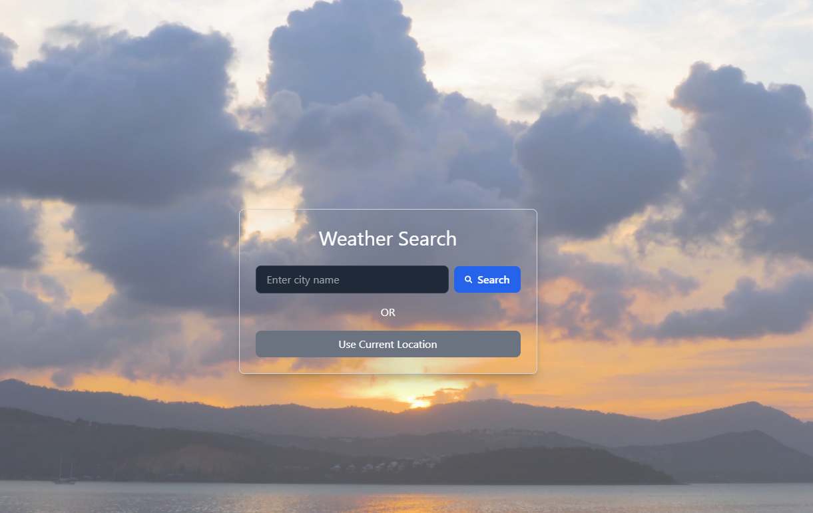
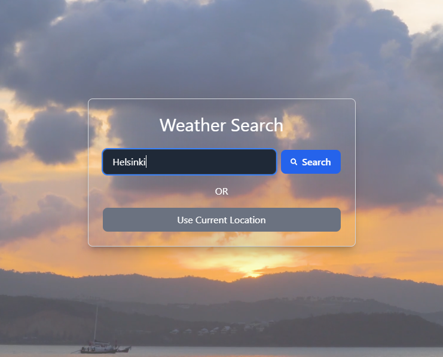
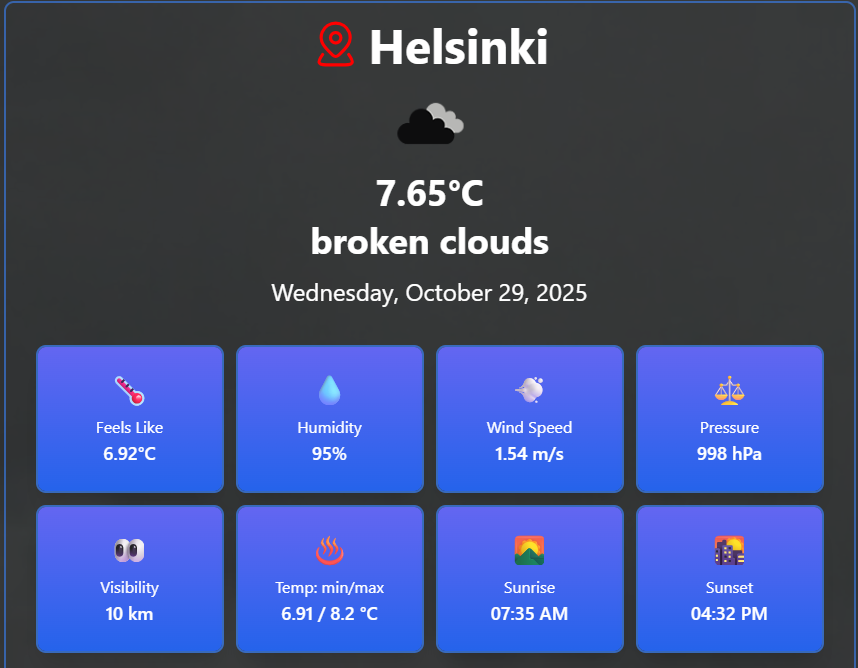
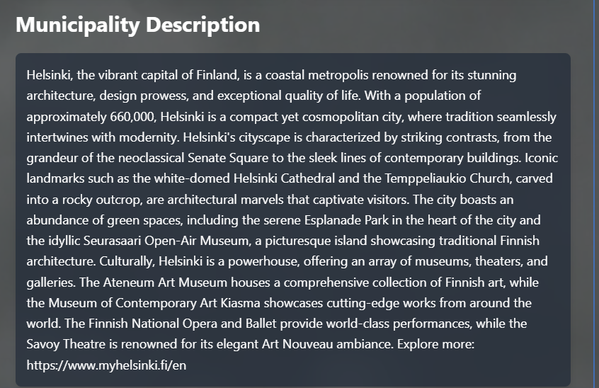
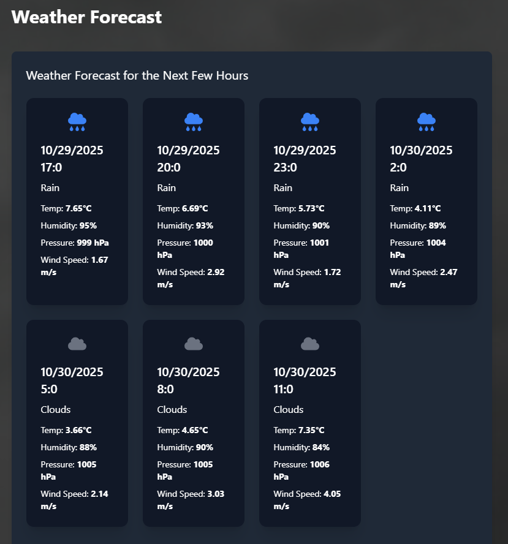
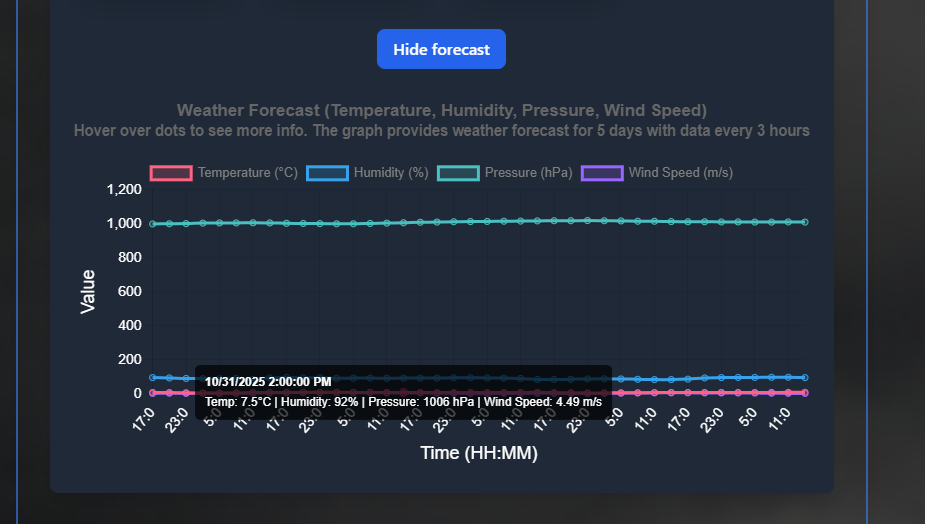
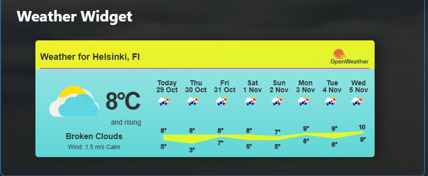
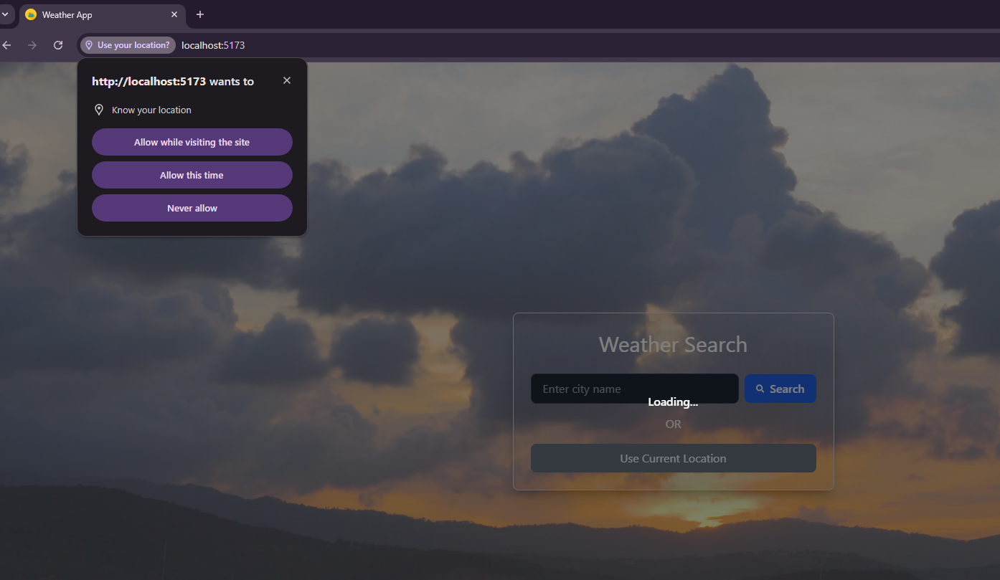

# Weather App – Project Plan and Overview

## 1. Problem Description

Weather impacts daily life — from planning commutes to scheduling events and making travel decisions. However, accessing reliable and detailed weather data for a specific area often requires navigating multiple sources. Users need a **centralized, intuitive tool** that not only provides weather information but also interprets it in a useful, human-friendly way.

### Aspects Solved by the Program
- Fetching and displaying **real-time weather data** for any location.
- Presenting **short-term (3-hour interval)** and **long-term (5-day)** forecasts.
- Providing a **visual map** of weather patterns.
- Generating an **AI-based description** of the searched area for added context.

---

## 2. How the Program Changes the Original Process

Traditionally, users check weather data through websites or apps that only show raw information (temperature, humidity, etc.) without much interpretation.  
The Weather App enhances this process by:
- Automating data retrieval and visualization.
- Summarizing key insights about the area using **Gemini AI**.
- Offering a **unified dashboard** for all relevant weather information.
- Reducing time spent switching between different platforms.

---

## 3. Requirements Placed on the Program

To effectively solve the problem, the program must:
- Connect to **OpenWeatherAPI** to fetch accurate weather data.
- Communicate with **Gemini AI API** for generating contextual area descriptions.
- Support **user input** (search bar and geolocation access).
- Display **interactive visuals** like charts and maps.
- Handle **error cases** such as invalid searches or network issues.
- Be responsive and performant across devices.

---

## 4. How the Program Changes the Operating Model

Before: Users manually searched multiple platforms for fragmented weather data.  
After: The Weather App automates this process, providing a **single, AI-assisted weather platform**.  
This change:
- Streamlines user experience.
- Reduces dependency on multiple tools.
- Adds an **interpretive layer** (AI) that transforms raw data into meaningful insights.

---

## 5. Usage Scenarios

The app will be used in:
- **Daily planning** – Users check current weather and forecast.
- **Event scheduling** – Users assess weather risks using forecast charts and maps.
- **Educational purposes** – Understanding how AI interprets geographical and climate data.

### Requirements from Usage Scenarios
- Should run as a **web application** (no server installation required).
- Must support **real-time data fetching** from APIs.
- Requires **internet connection** to function (for API calls).

---

## 6. Planned Software Architecture

**Architecture Type:** Client-Side SPA (Single Page Application)

**Components:**
- **Frontend:** React + Vite  
- **Styling:** Tailwind CSS  
- **Data Sources:** OpenWeatherAPI, Gemini AI  
- **Visualization:** Chart components for forecasts, embedded weather map  

**Why this architecture:**
- Ensures **fast load times** via Vite’s optimized build system.
- Simplifies deployment — only a static hosting environment is needed.
- React enables **component reusability** and **efficient UI updates**.

---

## 7. Ensuring Correct Functioning

To maintain correctness:
- Validate API responses before rendering.
- Implement error handling for failed network requests.
- Use mock data for testing UI rendering.
- Conduct manual and automated testing (via unit and integration tests).

---

## 8. Usability Considerations

- **Responsive design** for all screen sizes.
- **Clear visual hierarchy** (temperature, forecast, map, and AI output).
- **Accessible search and navigation** (keyboard-friendly and ARIA-compliant).
- **Loading indicators** to improve perceived performance.
- **Lightweight interface** with fast rendering due to Vite and Tailwind.

---

## 9. Program Usage Instructions

1. **Search** for a municipality or allow location access.
2. View **current weather conditions** and **forecast**.
3. Explore the **weather map** for real-time visual data.
4. Read the **AI-generated description** for insights about the area.
5. Optionally, view the **forecast chart** to understand upcoming weather trends.

---

## 10.  Getting Started
### Prerequisites
Before running the project, ensure you have the following installed:

- **Node.js** 
- **npm** (Node Package Manager)
- **Git**

You will also need API keys for:

- OpenWeatherAPI
- Gemini AI (Google API Key)

## Getting API Keys

### 1. OpenWeatherAPI

1. Visit [OpenWeatherMap](https://home.openweathermap.org/).
2. Sign up or log in to your account.
3. Navigate to the **API Keys** section.
4. Copy or Generate a new API key.
5. Copy the key for later use.

### 2. Gemini AI (Google API Key)

1. Visit the [Google AI Studio](https://aistudio.google.com/app/apikey).
2. Sign up or log in with your Google account.
3. Generate an API key from the **API Console** by clicking Create API Key button.
4. Choose project name as Gemini API.
4. Copy the key for later use.

## Installation

Follow these steps to set up and run the Weather App:

1. **Clone the repository**:  
   Open your terminal and run the following command to clone the repository:

   ```bash
   git clone https://github.com/zprakash/Weather-App.git
   ```

2. **Navigate to the project directory**:  
   Move into the project folder:

   ```bash
   cd Weather-App
   ```

3. **Install dependencies**:  
   Install all the required packages using npm:

   ```bash
   npm install
   ```

4. **Set up API KEYS**:  
   Go to a `.env` file in the root directory of the project and add your API keys:

   ```env
   VITE_WEATHER_API_KEY="your-openweather-api-key"
   VITE_GEMINI_API_KEY="your-gemini-api-key"
   ```

   Replace `your-openweather-api-key` and `your-gemini-api-key` with your actual API keys.

5. **Run the development server**:  
   Start the application locally with the following command:

   ```bash
   npm run dev
   ```

6. **Access the app**:  
   Open your browser and go to:

   ```
   http://localhost:5173
   ```

   The app will now be running locally.

## Screenshots

### Home Page


### Search


### Current Weather


### Description


### Forecast Details


### Forecast Graph


### Widget


### Auto location detection


## 11. Summary

The Weather App bridges the gap between **raw meteorological data** and **user-friendly interpretation**.  
It transforms how users interact with weather information — combining accurate forecasts, AI insights, and interactive visuals into one seamless experience.


## 12. Contributing

If you'd like to contribute to this project, feel free to fork the repository and submit a pull request. Make sure to follow the coding style and test any changes you make.
